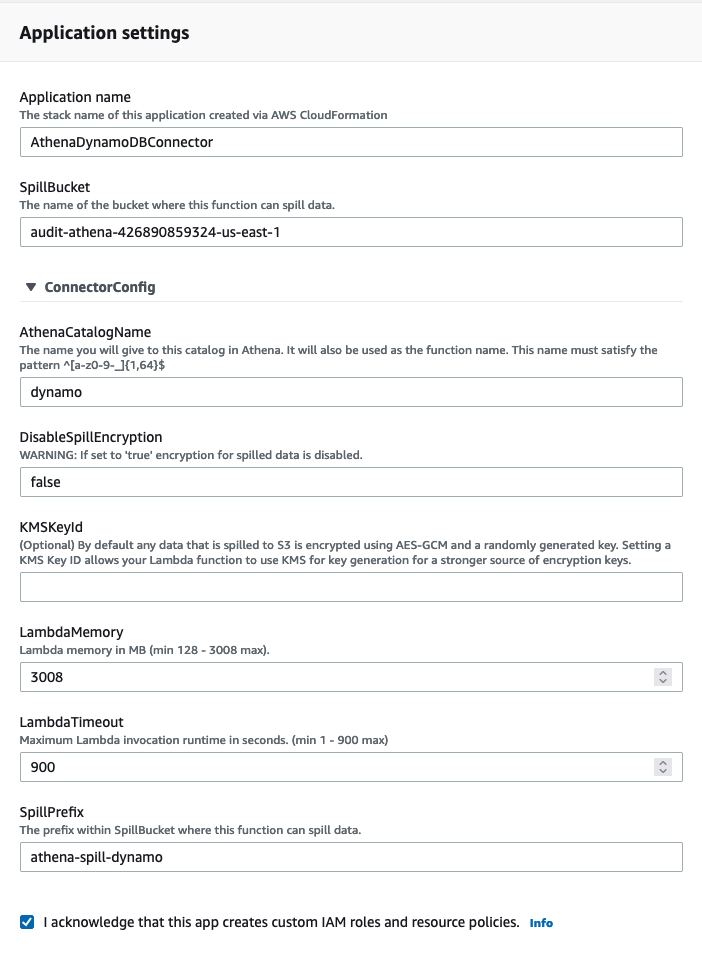

# Visualize Service Catalog Product Usage in an AWS Organization with Amazon QuickSight

AWS Service Catalog is a widely used service that simplifies the management of tools, services, and resources in AWS accounts for organizations. This service empowers end users to provision products vetted by their organization in their environments with confidence in security and compliance. Portfolios are shared with AWS accounts in an AWS Organization, from which end users simply need to launch products.

This post provides a logging and reporting solution for customers with a hub and spoke account setup where the hub account is used to create products and portfolios which are then shared and provisioned on spoke accounts. An enterprise using this type of setup would have many hundreds of spoke accounts across different regions in which different teams would be provisioning products available to them. Since this activity is tracked in the corresponding spoke accounts, a centralized monitoring and logging solution, through which the Business can receive a consolidated overview of such activities in the hub account, becomes imperative for effective governance.

The following solution implements this, and then shares the KPIs required by the business to understand and track the products provisioned in all of the spoke accounts by using:

1. A business intelligence dashboard in Amazon QuickSight sharing the relevant KPIs.
2. A query tool in Amazon Athena to pull specific details.

This will let the business infer the product usage that enables them to make data-driven decisions on their cloud adoption roadmap and retrospectives.

## Prerequisites

The following services are required:

- [AWS Organizations](https://aws.amazon.com/organizations/)
- [AWS Service Catalog](https://aws.amazon.com/servicecatalog/)
- [Amazon QuickSight](https://aws.amazon.com/quicksight/)
- [Amazon DynamoDB](https://aws.amazon.com/dynamodb/)
- [AWS Lambda](https://aws.amazon.com/lambda/)
- [Amazon CloudWatch](https://aws.amazon.com/cloudwatch/)
- [AWS CloudFormation](https://aws.amazon.com/cloudformation/)
- [Amazon Athena](https://aws.amazon.com/athena/)

## Overview

The AWS Service Catalog reporting implementation tracks when AWS Service Catalog products are provisioned in each of the spoke accounts in a given Organization. When provisioned, products are only visible in each account’s AWS Service Catalog console. However, this implementation means that the provisioned products and their details are aggregated to the hub account. Once they’re aggregated and stored in a central DynamoDB table, the provisioned product details can be queried by Athena and visualized by QuickSight.

1. User provisions, updates, or terminates a product in a spoke account.
2. Event rule in spoke account captures the matching event from [Amazon CloudTrail](https://aws.amazon.com/cloudtrail/) events, and forwards to hub account's custom event bus
    1. If event fails to send to hub account's custom event bus, then send to hub account's DLQ SQS.
3. Both the custom event bus and the DLQ SQS can trigger the event processor Lambda.
4. Event processor Lambda checks the event payload to determine if it's a ProvisionProduct, UpdateProvisionedProduct, or TerminateProvisionedProduct event.
    1. If the event is ProvisionProduct, then create a new row item in the audit DynamoDB table.
    2. If the event is UpdateProvisionedProduct, then update the matching provisionedProductId item in the audit DynamoDB table.
    3. If the event is TerminateProvisionedProduct, then delete the matching provisionedProductId item from the audit DynamoDB table.

### Processing events

Events are processed by the event processor Lambdas provisioned in all of the regions to which the hub StackSet is deployed. Furthermore, it writes to the central DynamoDB table located in the hub account's primary region. An SQS dead-letter queue is present in all of the regions in the hub account, and it accepts events that were unsuccessfully delivered to the hub account's custom event bus from the spoke accounts from the same region.

Moreover, events are archived in the hub account's primary region for future historical replay. Initiating a replay will result in the event processing Lambda to process all of the events from the last 90 days. The Lambda will not make duplicate entries if an AWS Service Catalog product has already been inserted into the table.

### Amazon DynamoDB

The values input into the audit DynamoDB table are derived from the CloudTrail event emitted from the product origin account.  The values from the `recordDetail` nested schema are parsed, along with some other pertinent values.

**Currently parsed keys:**

| Key                       | Example                           |
| ------------------------- | --------------------------------- |
| **productId**             | "prod-unvdcyl6aixxo"              |
| account                   | "123456796951"                    |
| createdTime               | "Jul 23, 2021 12:32:33 AM"        |
| pathId                    | "lpv2-me43omhkcvwku"              |
| productName               | "Amazon EC2 Linux"                |
| provisionedProductId      | "pp-nehfvaqsy3ikk"                |
| provisionedProductName    | "Amazon_EC2_Linux-07230016"       |
| provisionedProductType    | "CFN_STACK"                       |
| provisioningArtifactId    | "pa-7aaaieidrzllo"                |
| provisioningArtifactName  | "v1.0"                            |
| recordErrors              | []                                |
| recordId                  | "rec-x2p3curxfi3u4"               |
| recordTags                | []                                |
| recordType                | "TERMINATE_PROVISIONED_PRODUCT"   |
| region                    | "us-east-1"                       |
| status                    | "CREATED"                         |
| updatedTime               | "Jul 23, 2021 12:32:33 AM"        |

## Deploy the solution

1. Designate an account that will act as the hub which aggregates all of the data and hosts the DynamoDB table.  [Refer to the Simplify sharing your AWS Service Catalog portfolios in an AWS Organizations setup](https://aws.amazon.com/blogs/mt/simplify-sharing-your-aws-service-catalog-portfolios-in-an-aws-organizations-setup/) post if you do not currently have AWS Service Catalog in your organization.
2. Deploy the `organization_infra_stack.yaml`  CloudFormation Stack in the hub account's primary region. The template will ask for the following parameters:
    1. OrganizationId: The AWS Organization ID is unique to your organization. Retrieve this value from Services, Management & Governance, and AWS Organizations, e.g., "o-f4sp1mk5g5".
    2. ResourceNamePrefix: Prefix for naming all of the resources created by this CloudFormation template, e.g., "service-catalog". You may leave the default value.
3. Create a zip package of the `service_catalog_audit.py` file found inside the `lambda/service_catalog_audit/` directory, and name the zip package `service_catalog_audit.zip`. Refer to [Deploy Python Lambda functions with .zip file archives](https://docs.aws.amazon.com/lambda/latest/dg/python-package.html). Then, place the zip package in the `lambda/service_catalog_audit/` directory.
4. Upload the `lambda` directory to the newly created "source-files-<account_id>-<region>" [Amazon Simple Storage Service (Amazon S3)](https://aws.amazon.com/s3/) bucket.  Refer to the documentation on [uploading objects to the S3 bucket](https://docs.aws.amazon.com/AmazonS3/latest/userguide/upload-objects.html). After the upload to the bucket is complete, the prefix structure will be "lambda/service_catalog_audit/".
5. Deploy the `audit_hub_stack.yaml` as a CloudFormation StackSet. Designate one account in your AWS Organization as a hub account with a primary region:
    1. Choose Self-service permissions
    2. Choose sc-stackset-parent-role as the admin role. This role was created by the `organization_infra_stack.yaml`  CloudFormation Stack.
    3. Type in sc-stackset-child-role as the execution role. This role was created by the `organization_infra_stack.yaml`  CloudFormation Stack.
    4. Choose `audit_hub_stack.yaml` as the template source.
    5. The template will ask for the following parameters:
        1. OrganizationId: The AWS Organization ID is unique to your organization. Retrieve this value from Services, Management & Governance, and AWS Organizations, e.g., "o-xxxxxxxxxx".
        2. ResourceNamePrefix: Prefix for naming all of the resources created by this CloudFormation template, e.g., "service-catalog". You may leave the default value.
        3. PrimaryRegion: Primary region to deploy central audit resources, such as the DynamoDB table, the [Amazon EventBridge](https://aws.amazon.com/eventbridge/) event bus, and the Athena table e.g., “us-east-1”.
        4. S3BucketName: Provide the name of the S3 bucket that has the Lambda deployment packages.  This is the S3 bucket created by the organization_infra_stack.yaml CloudFormation stack, e.g., "source-files-<account_id>-<region>".
        5. S3KeyPrefix: Provide the directory of the S3 bucket that has the lambda deployment packages, e.g., "lambda/service_catalog_audit/". You may leave the default value.
    6. Set deployment options:
        1. Select deploy stacks in accounts.
            1. Enter the AWS account ID of the desired hub account.
        1. Specify the regions where you’d like to deploy this stack:
            1. Select the region that you’ve input for **PrimaryRegion** parameter specified above. This is where the DynamoDB table, the EventBridge event bus, and the Athena table will reside.
            2. Select any other regions where users may provision AWS Service Catalog products.  These regions will just have the SQS DLQ and the event processor Lambda function.
6. Deploy the `audit_spoke_stack.yaml` as a CloudFormation StackSet to all of the spoke accounts where AWS Service Catalog is utilized to provision products.
    1. Choose Service-managed permissions.
        1. If you’re launching this StackSet from the hub account, and it’s not the Organizations management account, then [delegate the hub account as an administrator](https://docs.aws.amazon.com/AWSCloudFormation/latest/UserGuide/stacksets-orgs-delegated-admin.html).
    2. The template will ask for the following parameters:
        1. HubAccountId: The AWS account ID of the hub account created in the previous step.
        2. PrimaryRegion: Primary region where Hub central audit resources were deployed such as the DynamoDB table, EventBridge event bus, and the Athena table, e.g., "us-east-1".
        3. ResourceNamePrefix: Prefix for naming all of the resources created by this CloudFormation template, e.g., "service-catalog". You may leave the default value.
    3. Deployment targets can either be your entire AWS Organization or specific Organizational Units (OUs) that where AWS Service Catalog products will be provisioned.
    4. Select all of the regions matching the hub account deployment from the previous step.
7. To test create a product in a spoke account and verify that an item was inserted into the DynamoDB table found in the hub account's primary region.

### Athena DynamoDB Connector

The Amazon Athena DynamodDB connector enables Amazon Athena to communicate with DynamoDB, making your tables accessible via SQL.  To enable this connector navigate to [AWS Serverless Application Repository](https://aws.amazon.com/serverless/serverlessrepo/) and deploy a pre-built version of this connector.

Select the `AthenaDynamoDBConnector` application:

The audit hub stack in the hub account creates a Athena spill bucket that should be used when creating this connector. The name of the bucket can be found in the outputs of the stack.

In the console, navigate to Athena, and select “Data sources”. Then, create a new data source with DynamoDB as the source:

Name the data source `dynamo`, and select the Lambda function created by the `AthenaDynamoDBConnector` Serverless application:

The data source will be created with the associated `default` database:

Now you can now query the DynamoDB table with SQL:

### QuickSight

QuickSight will let us to visulize the data stored in the DynamoDB via the Athena connector deployed in the previous section.

#### Create aws-quicksight-s3-consumers-role-v0 role

In QuickSight, select the upper right drop-down menu, and select "Manage QuickSight". On the "Security & permissions" page under "QuickSight access to AWS services", select "Manage":

Deselect and select "Amazon Athena", then select “Next”. Once prompted, select "Lambda", and select the Dynamo DB connector Lambda.

This creates the “aws-quicksight-s3-consumers-role-v0” role with the required permissions to invoke the DynamoDB connector Lambda function.

#### Create a dashboard

First, we must create a dataset in QuickSight that points to the Athena catalog. In the console, navigate to QuickSight, then select “Datasets” in the left menu pane. Select “New dataset” to create a new dataset, and select Athena:

Create a new data source pointing to the Athena workgroup:

Select the Dynamo DB table created by the audit_hub_stack.yaml CloudFormation StackSet:

Either select to import to SPICE for period data loads, but faster performance, or directly query your data at the expense of slower up-to-date results.

Create a new analysis with the newly created dataset:

Finally, create visualizations using the data from the dataset.  Here are several examples:

## Clean up

1. Delete the audit_spoke_stack.yaml CloudFormation StackSet:
    1. First [delete the stack instances](https://docs.aws.amazon.com/AWSCloudFormation/latest/UserGuide/stackinstances-delete.html) from the stack set
    2. Then [delete the stack set](https://docs.aws.amazon.com/AWSCloudFormation/latest/UserGuide/stacksets-delete.html)
2. Delete the audit_hub_stack.yaml CloudFormation StackSet:
    1. Delete contents of the S3 buckets created by this stack set
    2. First [delete the stack instances](https://docs.aws.amazon.com/AWSCloudFormation/latest/UserGuide/stackinstances-delete.html) from the stack set
    3. Then [delete the stack set](https://docs.aws.amazon.com/AWSCloudFormation/latest/UserGuide/stacksets-delete.html)
3. Delete the QuickSight resources:
    1. [Delete the dashboard](https://docs.aws.amazon.com/quicksight/latest/user/deleting-a-dashboard.html)
    2. [Delete the analysis](https://docs.aws.amazon.com/quicksight/latest/user/deleting-an-analysis.html)
    3. [Delete the dataset](https://docs.aws.amazon.com/quicksight/latest/user/delete-a-data-set.html)

## Conclusion

In this post, we created a mechanism to aggregate AWS Service Catalog product activity within in an organization, and present the information with a QuickSight dashboard. This information can be used to understand AWS Service Catalog portfolio usage, the adoption of AWS services, and to make decisions on further development on AWS Service Catalog products.

## Troubleshooting

EventBridge may fail to send events from the spoke accounts to the hub account's custom event bus due to networking or access issues. In this event, the spoke account's event bus will forward the event to the hub account's dead letter queue SQS. These events will eventually be processed, and the remaining SQS messages will be deleted.

Event processor Lambda may fail to process an event due to a change in the schema or some transient issue. In this event, check the event processor Lambda function's CloudWatch logs to determine the root cause.

## Security

See [CONTRIBUTING](CONTRIBUTING.md#security-issue-notifications) for more information.

## License

This library is licensed under the MIT-0 License. See the LICENSE file.
